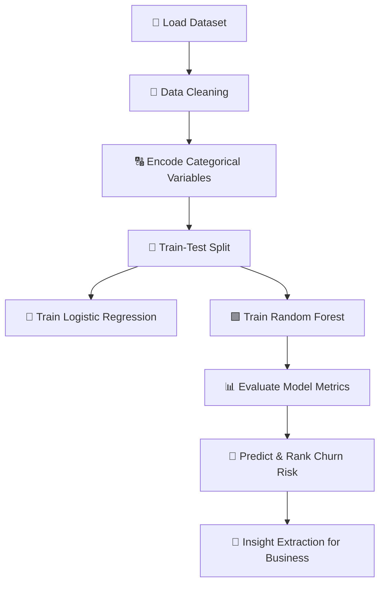

# 📊 Customer Churn Prediction & Retention Intelligence
### Predictive Analytics System for Early Churn Detection & Business Retention Strategy  
---

Customer churn is one of the biggest revenue leaks for subscription-based businesses.  
This Machine Learning project identifies **which customers are at risk of churn** and reveals **why they churn**, enabling companies to take proactive retention actions.

This repository demonstrates how ML models can analyze patterns in customer behavior, evaluate churn probability, and rank individuals by risk score for targeted interventions.

---

## ✨ Features

### 🔍 **1. Churn Probability Prediction**
- Trains models to predict whether a customer will leave or stay.
- Outputs probability score (0–1) for each user.
- Identifies **high-risk churn customers** for retention actions.

### 📈 **2. Machine Learning Modelling**
- Logistic Regression → Baseline benchmark model  
- Random Forest Classifier → High-performance churn detector  
- Eval metrics include **Accuracy, Recall, F1, ROC-AUC**

### 🧠 **3. Customer Behavior Insights**
Reveals the strongest churn-influencing factors:

| Factor | Impact |
|---|---|
| Tenure ↓ | High churn risk |
| MonthlyCharges ↑ | Higher churn probability |
| Month-To-Month Plan | Most unstable customer group |
| Auto-Payment Users | Churn significantly less |

### 📊 **4. Visual Analytics Dashboard**
- Feature importance ranking
- Churn distribution analysis
- Behavior-based churn segmentation

---

## 🔧 Tech Stack

| Layer | Tools Used |
|---|---|
| Language | Python |
| ML Framework | Scikit-Learn |
| Data Wrangling | Pandas, NumPy |
| Visualization | Matplotlib, Seaborn |
| Dataset | Telco Customer Churn (CSV) |

---

## 🔥 Project Workflow

| Model               | Result                              |
| ------------------- | ----------------------------------- |
| Logistic Regression | *(Add Your Score)*                  |
| Random Forest       | *(Add Your Score)* + Best Performer |
# High-Risk Customer Output Example
Customer_Index | Churn_Probability | Prediction
-----------------------------------------------
2175           | 0.92              | Churn
3098           | 0.84              | Churn
1241           | 0.79              | Churn

🧠 Key Takeaways

✔ Early churn prediction helps prevent revenue loss
✔ Long-term customers retain better
✔ High monthly charges & flexible plans increase churn
✔ Random Forest detects churn more accurately

🚀 Future Enhancements

Add Streamlit/PowerBI dashboard

Deploy as FastAPI/Flask REST API

Build automated retention recommendation engine

⭐ If this repo helped you — consider giving a Star

Made with ⚡ Machine Learning + 📊 Data Intelligence
